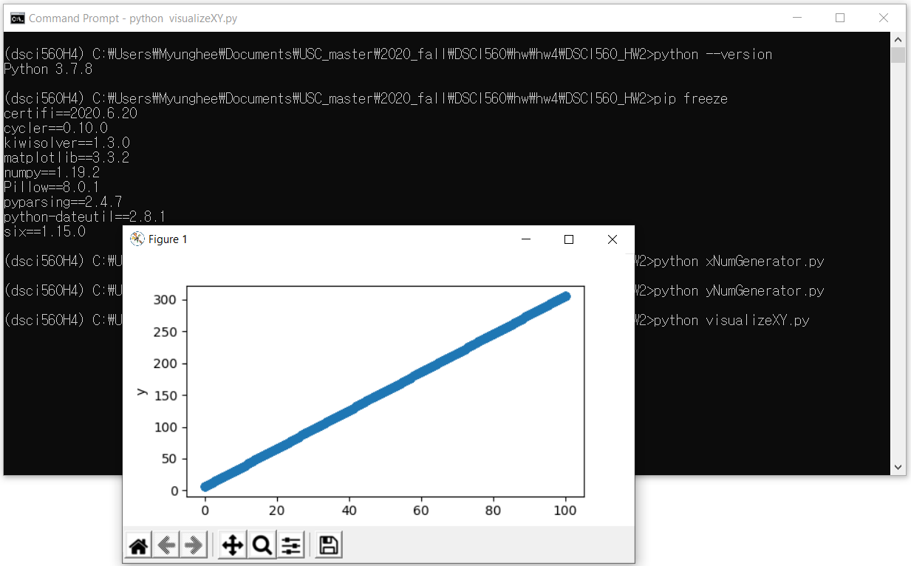

# DSCI560_HW4

<a href="https://zenodo.org/badge/latestdoi/298509821"></a>


# Q 1-3: Screenshot

<p align="center">
    
</p>

# Q 4: Dependencies of my virtual environment 
a. Python version: 3.7.9
1. The package I manually installed: matplotlib 3.3.2 by the command
```
pip install matplotlib
```
2. The dependency list extracted by the command
```
pip freeze
```
- certifi==2020.6.20
- cycler==0.10.0
- kiwisolver==1.3.0
- matplotlib==3.3.2
- numpy==1.19.2
- Pillow==8.0.1
- pyparsing==2.4.7
- python-dateutil==2.8.1
- six==1.15.0

The dependency list has more packages than the package I manually installed. The other packages are also installed because matplotlib requires those dependencies. 

b. ".gitignore" file has the environment folder "dsci560H4." 

c. "requirements.txt" was generated by the command
```
pip freeze > requirements.txt
```

# Q5, Q6b


# Q6a. Instructions for executing the project on your computer
1. Install Python 3.7.9
2. Open your terminal and go to the directory you want to download this repository
3. Download this repository and go to the folder you downloaded
```
git clone https://github.com/Myunghee13/DSCI560_HW2.git
```
4. Install virtualenv
```
pip install virtualenv
```
5. Create a virtual environment, dsci560H4
```
py -m venv dsci560H4
```
6. Activate the virtual environment, dsci560H4
```
.\dsci560H4\Scripts\activate
```
7. Install the dependencies
```
pip install -r requirements.txt
```
8. Execute the scripts  in sequence
```
python xNumGenerator.py

python yNumGenerator.py

python visualizeXY.py
```
9. You can see visualizations of initial, intermediate, and final results when each script is executed. All output files are in the directory, output.  
10. Deactivate the virtual environment, dsci560H4
```
deactivate
```
11. You can also execute these scripts with the notebook at once.


